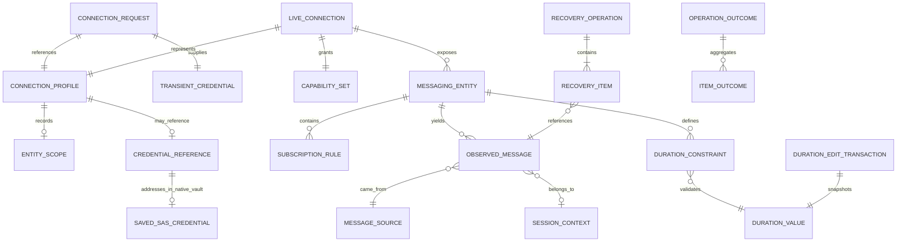
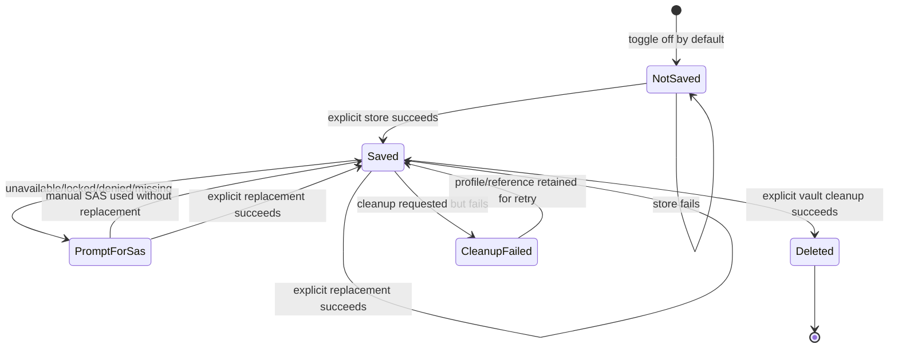
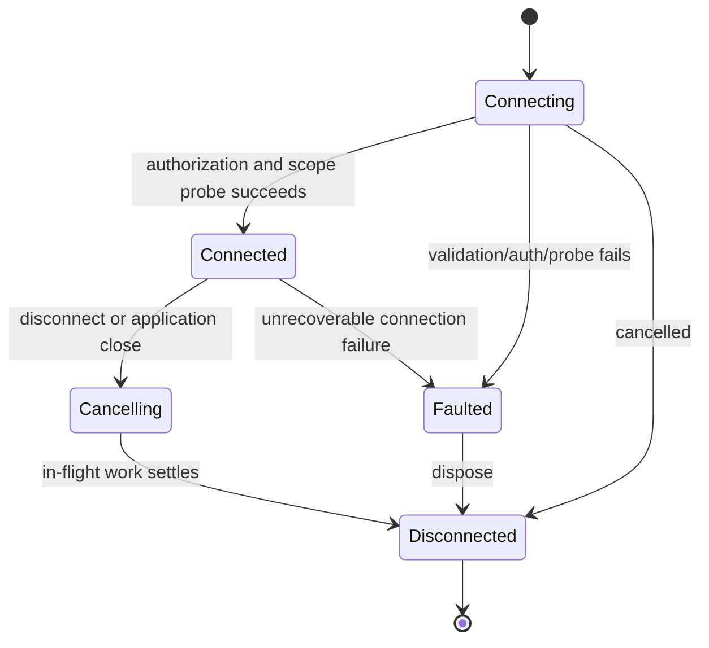
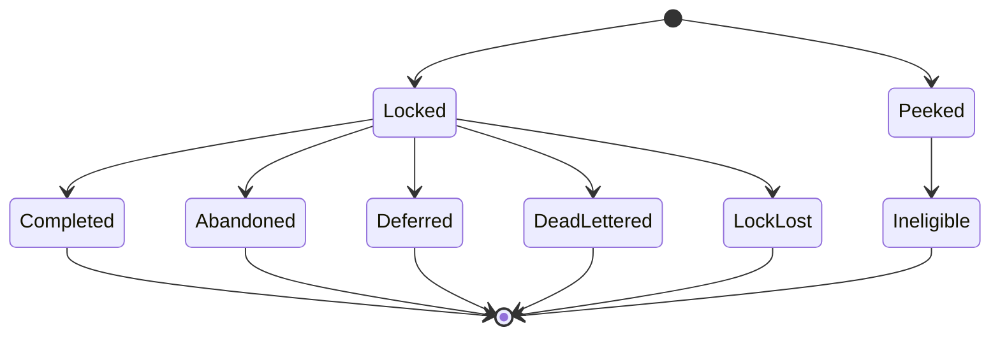

# Data Model: Safe Service Bus MVP

**Parent**: [spec.md](spec.md) | **Plan**: [plan.md](plan.md)

These are logical models and invariants. Azure SDK types remain inside Services adapters.

## Relationship Model

## ConnectionProfile

Secret-free persisted identity for reconnect.

| Field | Type | Rules |
|---|---|---|
| Id | stable opaque identifier | Required; generated locally |
| Label | string | Required, trimmed; duplicates allowed but remain distinguishable |
| FullyQualifiedNamespace | string | Required canonical `*.servicebus.windows.net` host, no credentials |
| AuthenticationMode | `Sas` or `Entra` | Required |
| EntraInteraction | `Default` or `InteractiveBrowser` | Present only for Entra |
| TenantId | string? | Optional directory identifier; never a token |
| Scope | `NamespaceScope` or `EntityScope` | Required |
| LoadingOptions | flags | Service Bus options only; excluded services have no flags |
| DisplayPreferences | allowlisted record | No body, property, token, or credential fields |
| CredentialReference | opaque random string? | Absent from first-internal schema; introduced only with native-vault milestone |
| SchemaVersion | positive integer | Required for defensive migration |

Validation rejects URI user information, query secrets, SAS key fields, complete connection
strings, and unknown serialized fields that could contain secret material.

Schema staging:

- **Internal schema v1** serializes `Id`, `Label`, `FullyQualifiedNamespace`,
  `AuthenticationMode`, optional `EntraInteraction`/`TenantId`, `Scope`, `LoadingOptions`,
  `DisplayPreferences`, and `SchemaVersion`. `CredentialReference` is not a JSON member.
- Selecting a v1 SAS profile produces metadata only. A fresh transient SAS string is mandatory for
  every connection and is never copied into the profile.
- Existing raw `ConnectionHistory` string arrays are legacy-secret input, not profiles. Migration
  may derive only reviewed endpoint/auth/scope metadata in memory, then atomically overwrite and
  verify the file; otherwise it removes the entries. Failure to eliminate the raw persisted values
  blocks internal startup/use.
- **Vault schema v2+** may add optional `CredentialReference` only after native-vault composition
  and lifecycle gates pass. It never changes the v1 no-secret invariant.

## CredentialReference, SavedSasCredential, and VaultOutcome

`CredentialReference` is a high-entropy random identifier used as the native-vault item key under
an application-specific service namespace. It is non-secret, contains no namespace, entity, key
name, hash, or credential-derived data, and is useless as authentication material.

`SavedSasCredential` is a full SAS connection string that exists only:

- transiently in memory while supplied to the connection factory or vault operation; and
- as the secret payload of the current OS user's designated native credential vault.

It is never a profile/settings field. Microsoft Entra access/refresh tokens are not
`SavedSasCredential` values and are outside this feature.

`CredentialVaultStatus` is a closed set:

- `Available`
- `Unavailable`
- `Locked`
- `PermissionDenied`
- `ProviderMissing`
- `Unsupported`
- `NotFound`
- `Uncertain`
- `Failure`

Store/retrieve/delete return typed results containing status and safe recovery guidance. A
successful retrieve may carry a transient secret wrapper whose value is not serializable or
printable. Failure results never carry the secret or raw native error text.

Vault lifecycle:

Profile persistence ordering:

1. A new save generates a reference and stores the SAS in the vault.
2. Only a successful store permits persisting that reference in the profile.
3. Replacement uses the existing reference and does not silently create another item. A
   failed/uncertain result keeps the reference and does not claim whether the old or new value is
   present; the user may retry or enter SAS manually.
4. Profile removal without vault cleanup removes metadata only after explicit user choice.
5. Profile removal with cleanup attempts vault deletion first; failure keeps the profile/reference
   available for retry unless the user explicitly chooses metadata-only deletion after being warned.

## ConnectionRequest and TransientCredential

Ephemeral input used to establish one live context.

- `ConnectionRequest`: selected profile values, requested capability set, transport preference, and
  one `TransientCredential`.
- `TransientCredential` discriminated union:
  - `SasConnectionString` held only for the attempt/live client construction.
  - `TokenCredentialReference` wrapping the selected Azure Identity credential.
- Neither type is serializable by the profile store or included in diagnostic context.
- A reconnect may resolve `CredentialReference` through `ICredentialVault`; any non-success result
  leaves the profile unchanged and converts the flow to manual `SasConnectionString` entry.

## LiveConnection

Async-disposable runtime context:

- profile ID and canonical endpoint;
- effective scope and entity path;
- selected capabilities;
- connection state: `Connecting`, `Connected`, `Cancelling`, `Disconnected`, `Faulted`;
- cancellation lifetime;
- messaging and optional administration service ports.

State transitions:

## CapabilitySet

Explicit booleans or flags derived from scope, selected loading options, and successful probes:

- browse queues/topics/subscriptions;
- administer queues/topics/subscriptions/rules;
- send;
- inspect active/dead-letter/transfer-dead-letter;
- receive/settle;
- sessions;
- deferred retrieval/recovery.

Capabilities describe what the current context can attempt, not a promise that Azure authorization
will never change. Permission failure still produces a typed outcome.

## MessageSource

Closed value set:

- `Active`
- `DeadLetter`
- `TransferDeadLetter`

There is no `None`, `Default`, or `Unspecified` value. View model selection is nullable until the
user chooses. Every peek, receive, purge, and recovery request carries a non-null source.
Unsupported transfer dead-letter is an unavailable outcome, never active fallback.

## MessagingEntity and SubscriptionRule

`MessagingEntity` identifies queue, topic, or subscription, service etag/version, status, counts,
routing relationships, immutable attributes, and supported mutable settings.

`SubscriptionRule` contains name, typed filter (SQL, correlation, catch-all), optional action, and
service version. Catch-all behavior is explicit. Updates carry the last-observed version so
concurrent changes yield conflict/stale outcomes.

## MessageDraft

Contains destination, body bytes and representation, common broker properties, scheduling,
session/correlation/reply/content/TTL values, and typed custom properties.

Validation:

- draft remains in memory after validation or send failure;
- reserved/conflicting/duplicate-case property names are rejected specifically;
- duration precision is milliseconds and no product day cap is applied;
- body/properties are never routine diagnostic fields.

## SendTargetContext

Typed, non-secret context shared by the send ViewModel and outcome presentation:

| Field | Meaning |
|---|---|
| RequestedContext | `Queue`, `Topic`, or `Subscription` |
| ContextDisplayName | Queue/topic/subscription name shown to the user |
| ActualDestinationKind | `Queue` or `Topic` |
| ActualEntityPath | Queue path or parent topic path passed to the current backend |
| ParentTopicName | Required only for subscription context |

Invariants:

- Queue context sends to that queue.
- Topic context publishes to that topic.
- Subscription context publishes to its parent topic; it never forms or reports a direct
  subscription-send path.
- Pre-submit text and success/failure outcomes use `ActualDestinationKind` and
  `ActualEntityPath`; requested subscription context remains visible for orientation.
- `SendTargetContext` changes presentation/orchestration context only. The internal milestone
  continues to call the existing `IQueueService.SendAsync(actualEntityPath, message)` path.

## DurationValue

Framework-neutral immutable product value:

| Field/derived component | Range |
|---|---|
| TotalMilliseconds | `0..922337203685477` |
| Days | `0..10675199`, constrained by composed total |
| Hours | `0..23` |
| Minutes | `0..59` |
| Seconds | `0..59` |
| Milliseconds | `0..999` |

`DurationValue` stores total whole milliseconds and can losslessly map to/from a non-negative
millisecond-aligned `TimeSpan`. Negative values, sub-millisecond ticks, overflow, infinity, and
fractional components are outside the shared range.

Strict canonical representation:

- grammar: `D.HH:MM:SS` or `D.HH:MM:SS.fff`;
- `D` is one or more ASCII decimal digits with no sign;
- `HH`, `MM`, and `SS` are exactly two digits;
- `fff` is exactly three digits and is omitted only when milliseconds equal zero;
- parsing is culture-invariant and never interprets a missing day, unit suffix, locale separator,
  or alternate component width.

Representative values: `0.00:00:00`, `12.03:04:05`, `12.03:04:05.006`, and maximum
`10675199.02:48:05.477`.

## DurationConstraint

Contextual validation record separate from `DurationValue`:

- Azure property display/name;
- optional inclusive minimum and maximum `DurationValue`;
- explicit allowed special-value policy, if that property supports one;
- safe validation message template.

A constraint may report that a representable value cannot be applied to a named Azure property. It
MUST NOT clamp, normalize, mutate, or redefine the shared `DurationValue` range.

## DurationEditTransaction

App-facing transaction state with framework-neutral semantics:

- `Original`: immutable bound snapshot captured when editing begins;
- `PrimaryDraft`: invariant text draft;
- `ComponentDrafts`: raw Days/Hours/Minutes/Seconds/Milliseconds strings;
- `FieldErrors`: parse/component errors keyed by field;
- `ContextError`: optional named Azure property limit error;
- `Candidate`: composed `DurationValue` only when all shared validation passes.

```mermaid
stateDiagram-v2
    [*] --> Closed
    Closed --> Editing: open or type; snapshot Original
    Editing --> Invalid: parse/component/context failure
    Invalid --> Editing: correct draft
    Editing --> Committed: Apply valid Candidate
    Invalid --> Invalid: Apply blocked
    Editing --> Cancelled: Cancel/Escape/light-dismiss
    Invalid --> Cancelled: Cancel/Escape/light-dismiss
    Committed --> Closed: bound value changes once; focus Edit
    Cancelled --> Closed: Original unchanged; focus Edit
```

No draft field binds directly to the committed value. Apply is the sole commit transition.

## ObservedMessage

Contains message ID, source, receive kind (`Peeked` or `Locked`), sequence number, delivery count,
enqueued/scheduled times, body representation, metadata, session ID, lock expiry, and settlement
state.

Settlement state machine:

Only `Locked` is settleable. A terminal outcome cannot be applied twice.

## SessionContext

Contains requested/accepted session ID, source, entity, lock expiry, and ownership state:
`Acquiring`, `Owned`, `Renewing`, `Lost`, `Released`, or `Faulted`. Message operations require
`Owned`; `Lost` immediately disables unsafe continuation.

## ConfirmationRequest

| Field | Meaning |
|---|---|
| Operation | Delete entity/rule, purge, receive-and-delete, bulk settle, or recover |
| TargetKind / TargetName | Named affected resource |
| MessageSource | Required for source-specific operations |
| Consequence | Stable operation-specific consequence text key |
| ItemCount | Optional known batch size |
| Risk | Destructive or irreversible-loss |

Result is `Confirmed` or `Cancelled`. Cancellation does not invoke the operation port.

## RecoveryOperation and Outcomes

Recovery records source, selected message identities, explicit destination, dead-letter diagnostic
property treatment (`RetainAsCustom` or `Remove`), and item outcomes.

Per-item state:
`Pending -> ReplacementSent -> OriginalSettled` when settleable, or terminal `Succeeded`,
`Failed`, `Cancelled`, `Uncertain`. The original is never settled before `ReplacementSent`.
Confirmed successes are excluded from automatic retry.

`OperationOutcome` contains category, safe operation/target context, retry guidance, and item
outcomes. It cannot contain credentials, tokens, message bodies, custom properties, or raw SDK
exception messages known to echo inputs.
