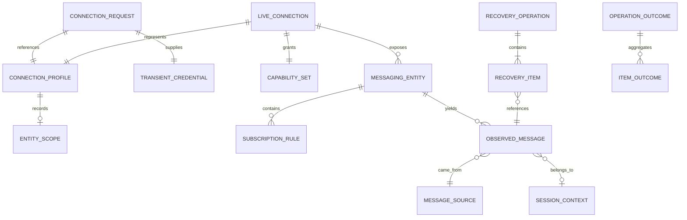
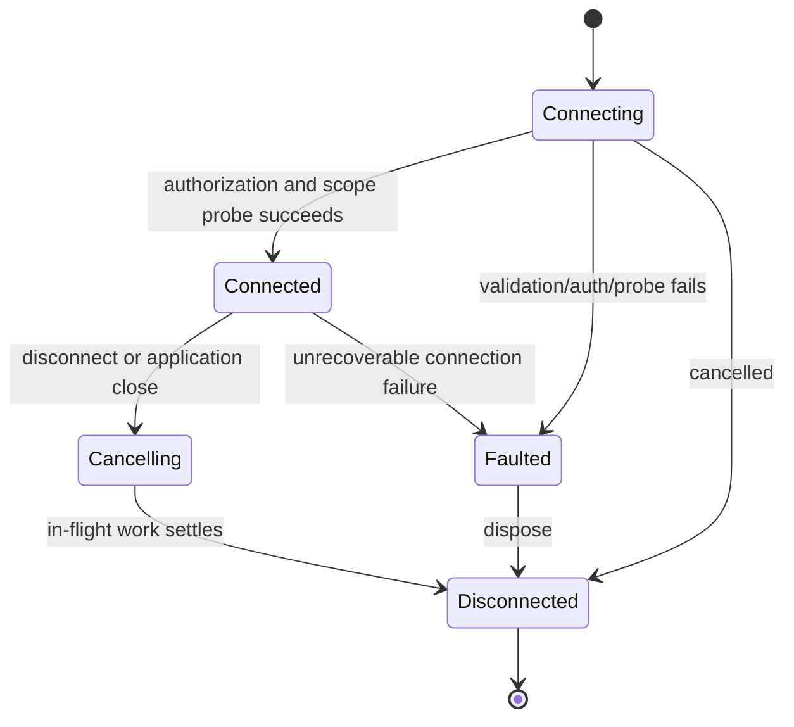
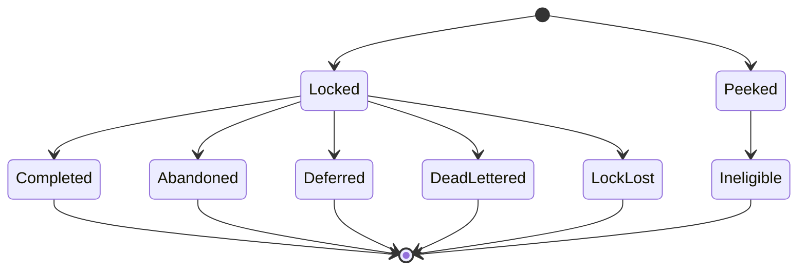

# Data Model: Safe Service Bus MVP

**Parent**: [spec.md](spec.md) | **Plan**: [plan.md](plan.md)

These are logical models and invariants. Azure SDK types remain inside Services adapters.

## Relationship Model

## ConnectionProfile

Secret-free persisted identity for reconnect.

| Field | Type | Rules |
|---|---|---|
| Id | stable opaque identifier | Required; generated locally |
| Label | string | Required, trimmed; duplicates allowed but remain distinguishable |
| FullyQualifiedNamespace | string | Required canonical `*.servicebus.windows.net` host, no credentials |
| AuthenticationMode | `Sas` or `Entra` | Required |
| EntraInteraction | `Default` or `InteractiveBrowser` | Present only for Entra |
| TenantId | string? | Optional directory identifier; never a token |
| Scope | `NamespaceScope` or `EntityScope` | Required |
| LoadingOptions | flags | Service Bus options only; excluded services have no flags |
| DisplayPreferences | allowlisted record | No body, property, token, or credential fields |
| SchemaVersion | positive integer | Required for defensive migration |

Validation rejects URI user information, query secrets, SAS key fields, complete connection
strings, and unknown serialized fields that could contain secret material.

## ConnectionRequest and TransientCredential

Ephemeral input used to establish one live context.

- `ConnectionRequest`: selected profile values, requested capability set, transport preference, and
  one `TransientCredential`.
- `TransientCredential` discriminated union:
  - `SasConnectionString` held only for the attempt/live client construction.
  - `TokenCredentialReference` wrapping the selected Azure Identity credential.
- Neither type is serializable by the profile store or included in diagnostic context.

## LiveConnection

Async-disposable runtime context:

- profile ID and canonical endpoint;
- effective scope and entity path;
- selected capabilities;
- connection state: `Connecting`, `Connected`, `Cancelling`, `Disconnected`, `Faulted`;
- cancellation lifetime;
- messaging and optional administration service ports.

State transitions:

## CapabilitySet

Explicit booleans or flags derived from scope, selected loading options, and successful probes:

- browse queues/topics/subscriptions;
- administer queues/topics/subscriptions/rules;
- send;
- inspect active/dead-letter/transfer-dead-letter;
- receive/settle;
- sessions;
- deferred retrieval/recovery.

Capabilities describe what the current context can attempt, not a promise that Azure authorization
will never change. Permission failure still produces a typed outcome.

## MessageSource

Closed value set:

- `Active`
- `DeadLetter`
- `TransferDeadLetter`

There is no `None`, `Default`, or `Unspecified` value. View model selection is nullable until the
user chooses. Every peek, receive, purge, and recovery request carries a non-null source.
Unsupported transfer dead-letter is an unavailable outcome, never active fallback.

## MessagingEntity and SubscriptionRule

`MessagingEntity` identifies queue, topic, or subscription, service etag/version, status, counts,
routing relationships, immutable attributes, and supported mutable settings.

`SubscriptionRule` contains name, typed filter (SQL, correlation, catch-all), optional action, and
service version. Catch-all behavior is explicit. Updates carry the last-observed version so
concurrent changes yield conflict/stale outcomes.

## MessageDraft

Contains destination, body bytes and representation, common broker properties, scheduling,
session/correlation/reply/content/TTL values, and typed custom properties.

Validation:

- draft remains in memory after validation or send failure;
- reserved/conflicting/duplicate-case property names are rejected specifically;
- duration precision is milliseconds and no product day cap is applied;
- body/properties are never routine diagnostic fields.

## ObservedMessage

Contains message ID, source, receive kind (`Peeked` or `Locked`), sequence number, delivery count,
enqueued/scheduled times, body representation, metadata, session ID, lock expiry, and settlement
state.

Settlement state machine:

Only `Locked` is settleable. A terminal outcome cannot be applied twice.

## SessionContext

Contains requested/accepted session ID, source, entity, lock expiry, and ownership state:
`Acquiring`, `Owned`, `Renewing`, `Lost`, `Released`, or `Faulted`. Message operations require
`Owned`; `Lost` immediately disables unsafe continuation.

## ConfirmationRequest

| Field | Meaning |
|---|---|
| Operation | Delete entity/rule, purge, receive-and-delete, bulk settle, or recover |
| TargetKind / TargetName | Named affected resource |
| MessageSource | Required for source-specific operations |
| Consequence | Stable operation-specific consequence text key |
| ItemCount | Optional known batch size |
| Risk | Destructive or irreversible-loss |

Result is `Confirmed` or `Cancelled`. Cancellation does not invoke the operation port.

## RecoveryOperation and Outcomes

Recovery records source, selected message identities, explicit destination, dead-letter diagnostic
property treatment (`RetainAsCustom` or `Remove`), and item outcomes.

Per-item state:
`Pending -> ReplacementSent -> OriginalSettled` when settleable, or terminal `Succeeded`,
`Failed`, `Cancelled`, `Uncertain`. The original is never settled before `ReplacementSent`.
Confirmed successes are excluded from automatic retry.

`OperationOutcome` contains category, safe operation/target context, retry guidance, and item
outcomes. It cannot contain credentials, tokens, message bodies, custom properties, or raw SDK
exception messages known to echo inputs.
