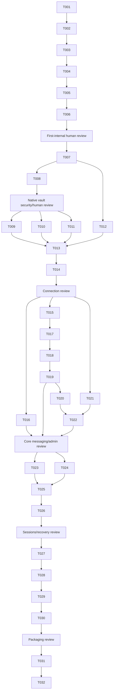

# Tasks: Safe Service Bus MVP

**Input**: Design documents from `specs/001-safe-servicebus-mvp/`

**Prerequisites**: `plan.md`, `spec.md`, `research.md`, `data-model.md`, `contracts/`

**Tests**: Every implementation unit writes a failing automated test first and finishes with its
independently runnable modern .NET 10 test command. The modern suites must not restore or build
`src/ServiceBusExplorer.Tests/ServiceBusExplorer.Tests.csproj`.

**Organization**: Tasks are grouped by independently testable user story. The approved US0 first
internal executable gate runs first as four focused, dependency-ordered units. Broader native-vault,
connection, messaging, administration, recovery, and packaging work follows only after its human
review. Each checklist item is one developer focus unit; tightly coupled tests and implementation
remain together.

## Format: `[ID] [P?] [Story] Description`

- **[P]**: May run concurrently only when its listed files are disjoint from other active tasks.
- **[Story]**: Maps to a user story in `spec.md`.

## Phase 1: First Internal Executable Gate — User Story 0 (Priority: P0)

**Goal**: Produce the restricted internal candidate with explicit dead-letter safety, secret-free
metadata-only history and SAS re-entry, truthful current-backend Send availability, and the approved
DurationEditor on every currently visible Service Bus duration field.

**Independent Test**: Run the focused modern unit/UI suite without restoring the legacy net472 test
project; verify explicit source routing and purge cancellation, inspect settings/history for zero
SAS material or credential references and reconnect SAS re-entry, resolve queue/topic/subscription
Send pages with captured queue/topic/parent-topic destinations, and exercise every inventoried
duration field at 820 DIPs and 100/150/200% scaling.

- [x] T001 [US0] Write failing safety regression tests first, then add explicit `MessageSource`, exhaustive Azure source mapping, nullable queue/subscription selection, typed `IConfirmationService`, and an accessible Avalonia purge dialog in `tests/Unit/ServiceBusExplorer.UnitTests.csproj`, `tests/Unit/Messaging/MessageSourceRoutingTests.cs`, `tests/Unit/ViewModels/PurgeConfirmationTests.cs`, `src/Core/Contracts/MessageSource.cs`, `src/Core/Contracts/Confirmation.cs`, `src/Core/Contracts/IConfirmationService.cs`, `src/Core/Contracts/IQueueService.cs`, `src/Services/ServiceBus/MessageSourceMapper.cs`, `src/Services/ServiceBus/QueueService.cs`, `src/ViewModels/Queues/QueueDetailViewModel.cs`, `src/ViewModels/Subscriptions/SubscriptionDetailViewModel.cs`, `src/App/Services/AvaloniaConfirmationService.cs`, `src/App/Views/Dialogs/ConfirmationDialog.axaml`, `src/App/Views/Dialogs/ConfirmationDialog.axaml.cs`, `src/App/Views/Queues/QueueDetailView.axaml`, `src/App/Views/Subscriptions/SubscriptionDetailView.axaml`, and `src/App/AppBootstrapper.cs`
- [x] T002 [US0] Write failing canary, migration, reconnect, and disk-inspection tests first, then disable the raw connection-string history path, atomically sanitize or remove legacy raw entries with fail-closed startup behavior, persist only versioned allowlisted non-secret profile metadata with no credential reference, keep every SAS value session-only, require full SAS re-entry for initial/repeat/post-restart connections, expose no vault/save-SAS UI, and show the revisioned **Internal development build** label and limitations in `tests/Unit/Connections/InternalHistorySafetyTests.cs`, `tests/UI/ServiceBusExplorer.UITests.csproj`, `tests/UI/Internal/InternalBuildLabelTests.cs`, `src/Core/Contracts/Connection.cs`, `src/App/SettingsService.cs`, `src/ViewModels/Connect/ConnectViewModel.cs`, `src/App/Views/Connect/ConnectView.axaml`, `src/App/Views/Connect/ConnectView.axaml.cs`, `src/App/Views/MainWindow.axaml`, `src/App/MainWindowViewModel.cs`, and `src/App/AppBootstrapper.cs`
- [x] T003 [US0] Write failing current-path Send availability, destination, complete field-guidance, required/accessibility, body/count/schedule-validation, and live-status tests first, then register `SendMessageViewModel -> SendMessageView`, retain typed actual-destination context and the existing `IQueueService.SendAsync(entityPath, message)` backend, preserve drafts on validation/backend failure, enforce composer ranges at the send boundary without coercion, announce errors/outcomes with appropriate live-region priority, and give every current editable field concise visible/programmatic meaning, format/unit, Azure effect, and truthful required/conditional/optional status while listing richer absent properties as deferred in `tests/Unit/Messaging/SendAvailabilityTests.cs`, `tests/UI/ViewResolution/SendMessageViewTemplateTests.cs`, `src/Core/Models/SendTargetContext.cs`, `src/ViewModels/Queues/SendMessageViewModel.cs`, `src/ViewModels/Queues/QueueDetailViewModel.cs`, `src/ViewModels/Topics/TopicDetailViewModel.cs`, `src/ViewModels/Subscriptions/SubscriptionDetailViewModel.cs`, `src/App/App.axaml`, and `src/App/Views/Queues/SendMessageView.axaml`
- [x] T004 [US0] Write failing Core duration tests first, then implement immutable whole-millisecond `DurationValue` strict invariant `D.HH:MM:SS[.fff]` parser/formatter/component validation, lossless non-negative millisecond-aligned `TimeSpan` conversion, separate named Azure-property `DurationConstraint` that never clamps the shared range, and framework-neutral isolated `DurationEditTransaction` draft/error/candidate state in `tests/Unit/Controls/DurationValueTests.cs`, `tests/Unit/Controls/DurationConstraintTests.cs`, `src/Core/Models/DurationValue.cs`, `src/Core/Models/DurationConstraint.cs`, and `src/Core/Models/DurationEditTransaction.cs`
- [x] T005 [US0] Write failing standalone Avalonia interaction/accessibility tests first, then rename `src/App/Views/Controls/TimeSpanControl.axaml` and `src/App/Views/Controls/TimeSpanControl.axaml.cs` to `src/App/Views/Controls/DurationEditor.axaml` and `src/App/Views/Controls/DurationEditor.axaml.cs` and implement the compact one-row invariant text plus Edit affordance, anchored Flyout with persistent Days/Hours/Minutes/Seconds/Milliseconds labels, direct typing and keyboard increments without a permanent spinner wall, field/context errors, logical automation/focus order, Apply-only commit, and exact-value rollback plus Edit-button focus restoration for Cancel/Escape/light-dismiss in `tests/UI/Controls/DurationEditorInteractionTests.cs` and `tests/UI/Accessibility/DurationEditorAccessibilityTests.cs`
- [x] T006 [US0] Write failing all-modern-surface duration/numeric inventory and responsive layout tests first, then keep `DurationEditor` universal for whole-millisecond durations (including relative Send scheduling), remove its retired compatibility alias, supply contextual constraints without narrowing or clamping, and apply one shared accessible integer pattern to every remaining count/size stepper with explicit labels, limits, increments, and unobscured controls at 820 DIPs and actual 96/144/192-DPI rendering in `tests/UI/Inventory/VisibleDurationFieldInventoryTests.cs`, `tests/UI/Layout/DurationEditorLayoutTests.cs`, `src/Core/Models/DurationConstraint.cs`, `src/ViewModels/Queues/SendMessageViewModel.cs`, `src/App/App.axaml`, `src/App/Views/Controls/DurationEditor.axaml.cs`, `src/App/Views/Queues/QueueDetailView.axaml`, `src/App/Views/Subscriptions/SubscriptionDetailView.axaml`, `src/App/Views/Topics/TopicDetailView.axaml`, and `src/App/Views/Queues/SendMessageView.axaml`

**First-internal review**: Human reviews all six focused diffs and tests, sanitized on-disk
settings/history, SAS re-entry and absent vault UI, actual Send destinations, complete visible-form
duration inventory, and internal-build labeling before any executable is shared or native-vault work
starts. This checkpoint is not a beads task.

**Status (2026-07-18)**: Approved by Andrii Petrovskyi. Evidence:
`docs/sdlc/reviews/first-internal-gate-approval.md`.
Phase 2 / US1 (T007+) is authorized to start.

---

## Phase 2: Connect Safely and Browse — User Story 1 (Priority: P1)

**Goal**: Support SAS and Entra connections with explicit scope/capabilities and secret-free,
versioned reconnect history.

**Independent Test**: Run the US1 filters in `tests/Unit/ServiceBusExplorer.UnitTests.csproj`,
`tests/Contract/ServiceBusExplorer.ContractTests.csproj`, and the current-OS
`tests/PlatformVault/ServiceBusExplorer.PlatformVaultTests.csproj`; verify every auth path, tenant
and scope, default-off saving, profile/reference allowlisting, vault lifecycle and typed failures,
native-store-only behavior with no fallback file, corrupt/legacy history handling, client disposal,
and bounded resource browsing without contacting Azure.

- [x] T007 [US1] Write failing profile and fake-vault lifecycle/failure tests first, then extend the T002 non-secret `ConnectionProfile` with optional CSPRNG opaque `CredentialReference`, add the non-serializable sensitive credential wrapper, typed vault outcomes, async `ICredentialVault` port, and defensive profile store ordering for store/retrieve/replace/delete failures without native dependencies in `tests/Unit/Connections/ConnectionProfileAndVaultContractTests.cs`, `src/Core/Contracts/Connection.cs`, `src/Core/Contracts/IConnectionProfileStore.cs`, `src/Core/Contracts/ICredentialVault.cs`, `src/Core/Models/CredentialVault.cs`, `src/App/SettingsService.cs`, and `src/App/Services/JsonConnectionProfileStore.cs`
- [x] T008 [P] [US1] Spike first-party native adapters versus a pinned maintained package, keep `ktsu.CredentialCache` 1.2.3 rejected, record license/maintenance/transitive/native-code/supply-chain/fallback review, and create a reusable no-file-fallback conformance/smoke harness before any production dependency is approved in `_code_agent/20260716-safe-servicebus-mvp/artifacts/tasks/T008/native-vault-evaluation.md`, `tests/PlatformVault/ServiceBusExplorer.PlatformVaultTests.csproj`, and `tests/PlatformVault/CredentialVaultConformance.cs`
- [x] T009 [P] [US1] After native-vault security and human approval, write Windows failure/restart smoke tests first, then implement the T008-approved package wrapper or first-party current-user Windows Credential Manager adapter with store/retrieve/replace/delete, typed error mapping, secret-safe memory handling, and no file or DPAPI fallback in `tests/PlatformVault/WindowsCredentialVaultSmokeTests.cs` and `src/App/Services/Credentials/WindowsCredentialVault.cs`
- [x] T010 [P] [US1] After native-vault security and human approval, write macOS failure/restart smoke tests first, then implement the T008-approved package wrapper or first-party login Keychain Services generic-password adapter with store/retrieve/replace/delete, typed error mapping, secret-safe memory handling, and no file fallback in `tests/PlatformVault/MacOsCredentialVaultSmokeTests.cs` and `src/App/Services/Credentials/MacOsCredentialVault.cs`
- [x] T011 [P] [US1] After native-vault security and human approval, write Linux provider/failure/restart smoke tests first, then implement the T008-approved package wrapper or first-party freedesktop Secret Service adapter through libsecret or a compatible provider with store/retrieve/replace/delete, D-Bus/provider-missing mapping, secret-safe memory handling, and no file/in-memory fallback in `tests/PlatformVault/LinuxCredentialVaultSmokeTests.cs` and `src/App/Services/Credentials/LinuxCredentialVault.cs`
- [ ] T012 [P] [US1] Write failing auth/scope/lifetime/vault-resolution contract tests first, then implement the single async-disposable SAS/Entra connection-context factory with explicit tenant, interaction mode, entity scope, capability probes, cancellation, vault retrieval that preserves failed references and requests manual SAS, Entra vault exclusion, and secret-safe failures in `tests/Contract/ServiceBusExplorer.ContractTests.csproj`, `tests/Contract/Connections/ConnectionContextFactoryTests.cs`, `src/Core/Contracts/IConnectionContextFactory.cs`, `src/Core/Models/LiveConnectionContext.cs`, `src/Core/Models/CapabilitySet.cs`, `src/Services/ServiceBus/ConnectionContextFactory.cs`, and `src/Services/ServiceBus/ServiceBusFailureTranslator.cs`
- [ ] T013 [US1] Write failing reconnect, default-off save, replace, cleanup, and auth-option view-model tests first, then integrate the platform vault and profile ordering into connect/history presentation and application composition so failed/uncertain native mutations preserve references, failed retrieval prompts for SAS, Entra never invokes the vault, and prior live contexts dispose once in `tests/Unit/ViewModels/ConnectViewModelTests.cs`, `src/ViewModels/Connect/ConnectViewModel.cs`, `src/App/Views/Connect/ConnectView.axaml`, `src/App/Views/Connect/ConnectView.axaml.cs`, and `src/App/AppBootstrapper.cs`
- [ ] T014 [US1] Write failing scope/capability navigation tests first, then implement bounded queue/topic/subscription browse and refresh behavior that exposes only authorized namespace or entity scope in `tests/Unit/ViewModels/ScopedNavigationTests.cs`, `src/Core/Contracts/INamespaceService.cs`, `src/Services/ServiceBus/NamespaceService.cs`, `src/ViewModels/MainViewModel.cs`, `src/ViewModels/Queues/QueueListViewModel.cs`, `src/ViewModels/Topics/TopicListViewModel.cs`, and `src/App/Views/MainView.axaml`

**Native vault decision review**: Security reviewer and human approve the T008 build-versus-package
decision before T009–T011, then review the resulting package/native adapter diffs and OS smoke
evidence before T013 integration. No dependency or adapter proceeds on an unapproved decision.

**T008 spike status (2026-07-18)**: Complete and **approved** (Andrii Petrovskyi). Recommendation is
**first-party native adapters**; `ktsu.CredentialCache` 1.2.3 remains rejected; no NuGet package
approved. Evidence: `docs/sdlc/design/T008-native-vault-evaluation.md` and
`tests/PlatformVault/CredentialVaultConformance.cs`. T009–T011 authorized.

**Milestone review — connection**: Human reviews credential boundaries, all three native-vault
smoke results, proof of no fallback file, auth failure tests, profile JSON evidence, scope behavior,
and context disposal before core messaging/admin work. This checkpoint is not a beads task.

---

## Phase 3: Inspect and Safely Operate on Messages — User Story 2 (Priority: P1)

**Goal**: Complete bounded message inspection, sending, receive modes, settlement, content handling,
and explicit operation outcomes without weakening the Phase 1 safety invariant.

**Independent Test**: Run US2 unit and contract filters; exercise active/dead-letter/
transfer-dead-letter peek and receive, send validation/draft preservation, receive-and-delete
confirmation, settlement eligibility, cancellation, partial purge outcome, and body representation.

- [ ] T015 [US2] Write failing bounded browse, body-representation, and deliberate copy/export warning tests first, then implement source-tagged peek with explicit empty/unavailable/truncated/binary states, continuation metadata, and intentional sensitive-content copy/export in `tests/Unit/Messaging/MessageBrowseTests.cs`, `src/Core/Models/ObservedMessage.cs`, `src/Core/Contracts/IMessageBrowseService.cs`, `src/Services/ServiceBus/MessageBrowseService.cs`, `src/ViewModels/Queues/QueueDetailViewModel.cs`, `src/ViewModels/Subscriptions/SubscriptionDetailViewModel.cs`, `src/App/Views/Queues/QueueDetailView.axaml`, and `src/App/Views/Subscriptions/SubscriptionDetailView.axaml`
- [ ] T016 [P] [US2] Write failing rich message-draft and application-service tests first, then extend the T003 available current-path composer with typed properties, scheduling/session/routing fields, full duration precision, draft preservation, and typed secret-safe send outcomes through the approved `IMessageSendService`, without owning or retesting App DataTemplate registration or queue/topic/subscription availability in `tests/Unit/Messaging/MessageDraftTests.cs`, `src/Core/Models/MessageDraft.cs`, `src/Core/Contracts/IMessageSendService.cs`, `src/Services/ServiceBus/MessageSendService.cs`, `src/ViewModels/Queues/SendMessageViewModel.cs`, and `src/App/Views/Queues/SendMessageView.axaml`
- [ ] T017 [US2] Write failing receive-mode and confirmation tests first, then implement explicit-source peek-lock and confirmed receive-and-delete orchestration with cancellable disposable handles in `tests/Contract/Messaging/MessageReceiveContractTests.cs`, `src/Core/Contracts/IMessageReceiveService.cs`, `src/Core/Contracts/IReceiveSession.cs`, `src/Services/ServiceBus/ReceiveSession.cs`, `src/Services/ServiceBus/MessageReceiveService.cs`, `src/ViewModels/Queues/QueueDetailViewModel.cs`, and `src/ViewModels/Subscriptions/SubscriptionDetailViewModel.cs`
- [ ] T018 [US2] Write failing single/bulk settlement state-machine and partial-outcome tests first, then implement complete, abandon, defer, and dead-letter eligibility so peeked, lock-lost, expired, successful, and terminal messages cannot settle twice or be automatically repeated in `tests/Unit/Messaging/SettlementEligibilityTests.cs`, `src/Core/Models/ObservedMessage.cs`, `src/Core/Models/SettlementState.cs`, `src/Core/Contracts/IMessageReceiveService.cs`, `src/Services/ServiceBus/ReceiveSession.cs`, `src/ViewModels/Queues/QueueDetailViewModel.cs`, and `src/ViewModels/Subscriptions/SubscriptionDetailViewModel.cs`
- [ ] T019 [US2] Write failing interrupted/partial purge and operation-state tests first, then add bounded cancellable purge outcomes, no whole-operation retries, and clear loading/cancelled/partial/failure presentation in `tests/Contract/Messaging/PurgeOutcomeTests.cs`, `src/Core/Models/OperationOutcome.cs`, `src/Core/Contracts/IPurgeService.cs`, `src/Services/ServiceBus/PurgeService.cs`, `src/ViewModels/Queues/QueueDetailViewModel.cs`, `src/ViewModels/Subscriptions/SubscriptionDetailViewModel.cs`, `src/App/Views/Queues/QueueDetailView.axaml`, and `src/App/Views/Subscriptions/SubscriptionDetailView.axaml`

---

## Phase 4: Administer Service Bus Entities — User Story 3 (Priority: P2)

**Goal**: Safely create, view, update, and delete queues, topics, subscriptions, and rules with
authoritative refresh and explicit stale/conflict behavior.

**Independent Test**: Run US3 contract and view-model filters against fakes; verify supported fields,
etag conflicts, named deletion confirmation, refresh after success/failure, and explicit catch-all
rule behavior.

- [ ] T020 [P] [US3] Write failing queue/topic lifecycle contract tests first, then implement service-supported create/update/delete mapping, version-aware stale/conflict outcomes, and authoritative refresh in `tests/Contract/Administration/EntityLifecycleTests.cs`, `src/Core/Contracts/IQueueService.cs`, `src/Core/Contracts/ITopicService.cs`, `src/Services/ServiceBus/QueueService.cs`, and `src/Services/ServiceBus/TopicService.cs`
- [ ] T021 [P] [US3] Write failing subscription/rule lifecycle and catch-all tests first, then implement subscription create/update/delete plus typed SQL/correlation/catch-all rule create/edit/delete, conflict, and refresh behavior in `tests/Contract/Administration/SubscriptionAndRuleLifecycleTests.cs`, `src/Core/Models/SubscriptionRule.cs`, `src/Core/Contracts/ISubscriptionService.cs`, `src/Services/ServiceBus/SubscriptionService.cs`, `src/ViewModels/Subscriptions/RuleListViewModel.cs`, and `src/App/Views/Subscriptions/RuleListView.axaml`
- [ ] T022 [US3] Write failing administration confirmation and stale-state view-model tests first, then require exact target confirmation for queue/topic/subscription/rule deletion and present validation, authorization, conflict, refreshed, or stale state in `tests/Unit/ViewModels/AdministrationSafetyTests.cs`, `src/ViewModels/Queues/QueueListViewModel.cs`, `src/ViewModels/Topics/TopicListViewModel.cs`, `src/ViewModels/Subscriptions/SubscriptionDetailViewModel.cs`, `src/App/Views/Queues/QueueListView.axaml`, `src/App/Views/Topics/TopicListView.axaml`, and `src/App/Views/Subscriptions/SubscriptionDetailView.axaml`

**Milestone review — core messaging/admin**: Human reviews US2 and US3 independent results, source
invariants, destructive confirmations, failure semantics, and authoritative refresh. This
checkpoint is not a beads task.

---

## Phase 5: Sessions and Selected Recovery — User Story 4 (Priority: P2)

**Goal**: Handle explicit session ownership, deferred retrieval, and selected-message recovery with
send-before-settle ordering and retry-safe partial outcomes.

**Independent Test**: Run US4 unit and contract filters; verify next/specific session acquisition,
loss disables work, deferred sequence lookup, explicit recovery destination/property treatment,
replacement send precedes original settlement, and successful items are not retried.

- [ ] T023 [P] [US4] Write failing session ownership state-machine tests first, then implement next/specific session acquisition, visible lock state, cancellation, loss handling, and reacquisition in `tests/Unit/Messaging/SessionContextTests.cs`, `src/Core/Models/SessionContext.cs`, `src/Core/Contracts/IMessageReceiveService.cs`, `src/Services/ServiceBus/MessageReceiveService.cs`, `src/Services/ServiceBus/ReceiveSession.cs`, `src/ViewModels/Queues/QueueDetailViewModel.cs`, and `src/ViewModels/Subscriptions/SubscriptionDetailViewModel.cs`
- [ ] T024 [P] [US4] Write failing deferred retrieval contract tests first, then implement explicit-source sequence-number lookup with current lock/authorization eligibility in `tests/Contract/Messaging/DeferredMessageTests.cs`, `src/Core/Contracts/IDeferredMessageService.cs`, `src/Services/ServiceBus/DeferredMessageService.cs`, and `src/Core/Models/ObservedMessage.cs`
- [ ] T025 [US4] Write failing recovery ordering and partial-failure tests first, then implement selected-message recovery with explicit destination, diagnostic-property treatment, send-before-settle, per-item outcomes, and retry requests excluding confirmed successes in `tests/Unit/Messaging/RecoveryOrchestratorTests.cs`, `src/Core/Models/RecoveryOperation.cs`, `src/Core/Contracts/IRecoveryService.cs`, and `src/Services/ServiceBus/RecoveryService.cs`
- [ ] T026 [US4] Write failing recovery confirmation and state presentation tests first, then expose selected dead-letter/deferred recovery, destination/property choices, cancellation, progress, and per-item retry-safe results in `tests/Unit/ViewModels/RecoveryViewModelTests.cs`, `src/ViewModels/Messaging/RecoveryViewModel.cs`, `src/App/Views/Messaging/RecoveryView.axaml`, `src/App/Views/Messaging/RecoveryView.axaml.cs`, `src/App/Views/Queues/QueueDetailView.axaml`, and `src/App/Views/Subscriptions/SubscriptionDetailView.axaml`

**Milestone review — sessions/recovery**: Human reviews ownership-loss and partial-failure evidence,
including proof that recovery never settles before a successful replacement send. This checkpoint
is not a beads task.

---

## Phase 6: Accessible Cross-Platform Preview — User Story 5 (Priority: P3)

**Goal**: Deliver honest Service Bus-only navigation, accessible P1 workflows, full-precision
durations, and launchable preview archives while retaining the legacy Windows fallback.

**Independent Test**: Run modern UI/accessibility tests and package launch smoke scripts on each
target RID; complete P1 workflows keyboard-only, inspect automation semantics, round-trip durations,
and verify package metadata plus separate legacy fallback guidance.

- [ ] T027 [P] [US5] Write failing navigation-scope tests first, then remove excluded Relay, Event Grid, Event Hubs, Notification Hubs, generator, and monitoring registrations/navigation from the preview without deleting legacy code in `tests/Unit/ViewModels/PreviewNavigationTests.cs`, `src/App/AppBootstrapper.cs`, `src/ViewModels/AppMainViewModel.cs`, `src/ViewModels/MainViewModel.cs`, and `src/App/Views/MainView.axaml`
- [ ] T028 [US5] Write failing Avalonia automation and keyboard-flow tests first, then add accessible names/roles/values/state announcements, logical tab order, visible focus, safe dialog defaults, and focus restoration for all P1 views including native-vault save/failure/cleanup states while preserving T004–T006 duration-specific evidence in `tests/UI/ServiceBusExplorer.UITests.csproj`, `tests/UI/Accessibility/P1AccessibilityTests.cs`, `src/App/Views/Connect/ConnectView.axaml`, `src/App/Views/MainView.axaml`, `src/App/Views/Queues/QueueDetailView.axaml`, `src/App/Views/Subscriptions/SubscriptionDetailView.axaml`, `src/App/Views/Queues/SendMessageView.axaml`, and `src/App/Views/Dialogs/ConfirmationDialog.axaml`
- [ ] T029 [US5] Write package and native-vault smoke assertions first, then add isolated modern test CI and produce self-contained `win-x64.zip`, `osx-x64.zip`, `osx-arm64.zip`, and `linux-x64.tar.gz` artifacts that launch and prove designated-vault store/retrieve/replace/delete, provider-failure behavior, and no fallback file with version/preview/RID/checksum/signing metadata in `tests/Packaging/PackageSmoke.Tests.ps1`, `tests/Packaging/NativeVaultPackageSmoke.Tests.ps1`, `scripts/publish-preview.ps1`, `src/App/App.csproj`, `.github/workflows/modern-tests.yml`, and `.github/workflows/preview-packages.yml`
- [ ] T030 [US5] Verify and document first-evaluator launch steps, supported OS floors, signing/notarization status, Linux Secret Service prerequisites, native-vault limitations, explicit exclusions, and separately launchable legacy Windows fallback in `README.md`, `docs/preview-installation.md`, and `docs/migration-plan-avalonia.md` (documentation-only; no additional automated test beyond T029 package, vault, and legacy build checks)

**Milestone review — packaging**: Human reviews all four artifact smoke results, accessibility
evidence on each OS, documentation accuracy, and legacy coexistence before preview release. This
checkpoint is not a beads task.

---

## Phase 7: Cross-Story Acceptance and Release Evidence

**Purpose**: Validate the assembled MVP without adding excluded services or provisioning Azure
resources.

- [ ] T031 Write opt-in, environment-identity live Azure acceptance fixtures for queue/topic/subscription/rule lifecycle, routing, sessions, deferred messages, recovery, permission denial, and throttling in `tests/LiveAzure/ServiceBusExplorer.LiveAzureTests.csproj`, `tests/LiveAzure/Fixtures/ServiceBusFixture.cs`, and `tests/LiveAzure/Scenarios/SafeServiceBusMvpTests.cs`
- [ ] T032 Run and record sanitized modern unit/contract/UI/live/package/native-vault results and the `specs/001-safe-servicebus-mvp/quickstart.md` scenarios in `_code_agent/20260716-safe-servicebus-mvp/artifacts/sdlc/test-reports/TEST-ServiceBusExplorer-m7n-safe-servicebus-mvp.md` (evidence-only; production behavior is covered by T001–T031)

---

## Dependencies & Execution Order

### Task dependency DAG

### Parallel opportunities

- T008 and T012 may run after T007 because the vault evaluation/harness and connection factory files
  are disjoint.
- T009, T010, and T011 may run together only after the T008 security/human decision; each owns one
  platform adapter, one native interop file, and one OS smoke file.
- T015 and T016 may run together after the connection review because browse files and the richer
  send application-service files are disjoint.
- T020 and T021 may run together because queue/topic lifecycle and subscription/rule files are
  disjoint; T022 integrates their presentation after both finish.
- T023 and T024 may run together because session and deferred service files are disjoint; both
  finish before T025.
- T001–T006 are intentionally serial because adjacent internal slices share current composition,
  Core duration contracts, detail views, or test-project files; no internal executable is shared
  before the review after T006.
- No other concurrency is authorized without re-checking file ownership.

## Implementation Strategy

1. Deliver T001–T006 in order: P0 routing, secret-free internal history, current-path truthful Send,
   Core duration semantics, reusable DurationEditor interaction, and complete visible-form
   duration inventory/layout coverage.
2. Stop at the first-internal human gate; share no executable until all six focused suites,
   settings inspection, SAS re-entry, destination truthfulness, duration inventory, and internal
   labeling are approved.
3. Only then define the vault contract, approve the native adapter strategy, complete all three OS
   adapters and broader connection integration, and review connection safety.
4. Complete richer messaging and administration without moving the T003 availability repair into
   the later send task.
5. Add sessions/recovery only after settlement and outcome models are stable.
6. Add general accessibility and packaging, then run opt-in live acceptance and capture sanitized
   evidence.

## Scope Guardrails

- Do not add Event Grid, Relay, Event Hubs, Notification Hubs, generators, load testing,
  throughput dashboards, monitoring, browser/mobile clients, Azure provisioning, legacy history
  import/migration beyond T002's mandatory raw-record sanitization or removal, full legacy
  import/export parity, or whole-source automatic replay.
- Extend `src/Core`, `src/ViewModels`, `src/Services`, and `src/App`; do not create a parallel
  production architecture or move legacy WinForms code.
- No task authorizes committing credentials, tokens, connection strings, message contents, or raw
  Azure exception payloads.
