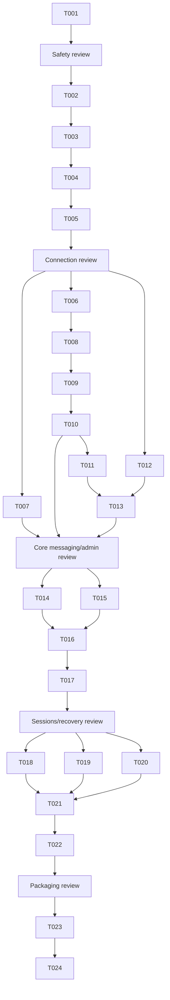

# Tasks: Safe Service Bus MVP

**Input**: Design documents from `specs/001-safe-servicebus-mvp/`

**Prerequisites**: `plan.md`, `spec.md`, `research.md`, `data-model.md`, `contracts/`

**Tests**: Every implementation unit writes a failing automated test first and finishes with its
independently runnable modern .NET 10 test command. The modern suites must not restore or build
`src/ServiceBusExplorer.Tests/ServiceBusExplorer.Tests.csproj`.

**Organization**: Tasks are grouped by independently testable user story. US2 starts first because
the approved P0 safety regression precedes the other P1 work. Each checklist item is one developer
focus unit; tightly coupled tests and implementation remain together.

## Format: `[ID] [P?] [Story] Description`

- **[P]**: May run concurrently only when its listed files are disjoint from other active tasks.
- **[Story]**: Maps to a user story in `spec.md`.

## Phase 1: P0 Safety Regression — User Story 2 (Priority: P1)

**Goal**: Make active, dead-letter, and transfer-dead-letter operation routing explicit, prove that
purging a dead-letter source cannot target active messages, and require typed purge confirmation.

**Independent Test**: Run only `tests/Unit/ServiceBusExplorer.UnitTests.csproj`; queue and
subscription tests prove null selection blocks purge, cancellation makes zero service calls,
confirmation names the entity/source/consequence, each source routes exactly, and dead-letter purge
never routes to active.

- [ ] T001 [US2] Write failing safety regression tests first, then add explicit `MessageSource`, exhaustive Azure source mapping, nullable queue/subscription selection, typed `IConfirmationService`, and an accessible Avalonia purge dialog in `tests/Unit/ServiceBusExplorer.UnitTests.csproj`, `tests/Unit/Messaging/MessageSourceRoutingTests.cs`, `tests/Unit/ViewModels/PurgeConfirmationTests.cs`, `src/Core/Contracts/MessageSource.cs`, `src/Core/Contracts/Confirmation.cs`, `src/Core/Contracts/IConfirmationService.cs`, `src/Core/Contracts/IQueueService.cs`, `src/Services/ServiceBus/MessageSourceMapper.cs`, `src/Services/ServiceBus/QueueService.cs`, `src/ViewModels/Queues/QueueDetailViewModel.cs`, `src/ViewModels/Subscriptions/SubscriptionDetailViewModel.cs`, `src/App/Services/AvaloniaConfirmationService.cs`, `src/App/Views/Dialogs/ConfirmationDialog.axaml`, `src/App/Views/Dialogs/ConfirmationDialog.axaml.cs`, `src/App/Views/Queues/QueueDetailView.axaml`, `src/App/Views/Subscriptions/SubscriptionDetailView.axaml`, and `src/App/AppBootstrapper.cs`

**Milestone review — safety**: Human verifies the focused diff and independent modern test result
before connection work starts. This checkpoint is not a beads task.

---

## Phase 2: Connect Safely and Browse — User Story 1 (Priority: P1)

**Goal**: Support SAS and Entra connections with explicit scope/capabilities and secret-free,
versioned reconnect history.

**Independent Test**: Run the US1 filters in `tests/Unit/ServiceBusExplorer.UnitTests.csproj` and
`tests/Contract/ServiceBusExplorer.ContractTests.csproj`; verify every auth path, tenant and scope,
profile serialization allowlist, corrupt/legacy history handling, client disposal, and bounded
resource browsing without contacting Azure.

- [ ] T002 [US1] Write failing profile serialization and migration tests first, then separate secret-free `ConnectionProfile` from transient credentials and implement defensive versioned history in `tests/Unit/Connections/ConnectionProfileStoreTests.cs`, `src/Core/Contracts/Connection.cs`, `src/Core/Contracts/IConnectionProfileStore.cs`, `src/App/SettingsService.cs`, and `src/App/Services/JsonConnectionProfileStore.cs`
- [ ] T003 [US1] Write failing auth/scope/lifetime contract tests first, then implement the single async-disposable SAS/Entra connection-context factory with explicit tenant, interaction mode, entity scope, capability probes, cancellation, and secret-safe failures in `tests/Contract/ServiceBusExplorer.ContractTests.csproj`, `tests/Contract/Connections/ConnectionContextFactoryTests.cs`, `src/Core/Contracts/IConnectionContextFactory.cs`, `src/Core/Models/LiveConnectionContext.cs`, `src/Core/Models/CapabilitySet.cs`, `src/Services/ServiceBus/ConnectionContextFactory.cs`, and `src/Services/ServiceBus/ServiceBusFailureTranslator.cs`
- [ ] T004 [US1] Write failing reconnect and auth-option view-model tests first, then update connect/history presentation and application composition to request transient SAS again, select Default or interactive Entra, clear obsolete credential inputs, and dispose the prior context exactly once in `tests/Unit/ViewModels/ConnectViewModelTests.cs`, `src/ViewModels/Connect/ConnectViewModel.cs`, `src/App/Views/Connect/ConnectView.axaml`, `src/App/Views/Connect/ConnectView.axaml.cs`, and `src/App/AppBootstrapper.cs`
- [ ] T005 [US1] Write failing scope/capability navigation tests first, then implement bounded queue/topic/subscription browse and refresh behavior that exposes only authorized namespace or entity scope in `tests/Unit/ViewModels/ScopedNavigationTests.cs`, `src/Core/Contracts/INamespaceService.cs`, `src/Services/ServiceBus/NamespaceService.cs`, `src/ViewModels/MainViewModel.cs`, `src/ViewModels/Queues/QueueListViewModel.cs`, `src/ViewModels/Topics/TopicListViewModel.cs`, and `src/App/Views/MainView.axaml`

**Milestone review — connection**: Human reviews credential boundaries, auth failure tests, profile
JSON evidence, scope behavior, and context disposal before core messaging/admin work. This
checkpoint is not a beads task.

---

## Phase 3: Inspect and Safely Operate on Messages — User Story 2 (Priority: P1)

**Goal**: Complete bounded message inspection, sending, receive modes, settlement, content handling,
and explicit operation outcomes without weakening the Phase 1 safety invariant.

**Independent Test**: Run US2 unit and contract filters; exercise active/dead-letter/
transfer-dead-letter peek and receive, send validation/draft preservation, receive-and-delete
confirmation, settlement eligibility, cancellation, partial purge outcome, and body representation.

- [ ] T006 [US2] Write failing bounded browse, body-representation, and deliberate copy/export warning tests first, then implement source-tagged peek with explicit empty/unavailable/truncated/binary states, continuation metadata, and intentional sensitive-content copy/export in `tests/Unit/Messaging/MessageBrowseTests.cs`, `src/Core/Models/ObservedMessage.cs`, `src/Core/Contracts/IMessageBrowseService.cs`, `src/Services/ServiceBus/MessageBrowseService.cs`, `src/ViewModels/Queues/QueueDetailViewModel.cs`, `src/ViewModels/Subscriptions/SubscriptionDetailViewModel.cs`, `src/App/Views/Queues/QueueDetailView.axaml`, and `src/App/Views/Subscriptions/SubscriptionDetailView.axaml`
- [ ] T007 [P] [US2] Write failing message-draft validation tests first, then implement single-message composition, typed properties, scheduling/session/routing fields, duration precision, draft preservation, and secret-safe send outcomes in `tests/Unit/Messaging/MessageDraftTests.cs`, `src/Core/Models/MessageDraft.cs`, `src/Core/Contracts/IMessageSendService.cs`, `src/Services/ServiceBus/MessageSendService.cs`, `src/ViewModels/Queues/SendMessageViewModel.cs`, and `src/App/Views/Queues/SendMessageView.axaml`
- [ ] T008 [US2] Write failing receive-mode and confirmation tests first, then implement explicit-source peek-lock and confirmed receive-and-delete orchestration with cancellable disposable handles in `tests/Contract/Messaging/MessageReceiveContractTests.cs`, `src/Core/Contracts/IMessageReceiveService.cs`, `src/Core/Contracts/IReceiveSession.cs`, `src/Services/ServiceBus/ReceiveSession.cs`, `src/Services/ServiceBus/MessageReceiveService.cs`, `src/ViewModels/Queues/QueueDetailViewModel.cs`, and `src/ViewModels/Subscriptions/SubscriptionDetailViewModel.cs`
- [ ] T009 [US2] Write failing single/bulk settlement state-machine and partial-outcome tests first, then implement complete, abandon, defer, and dead-letter eligibility so peeked, lock-lost, expired, successful, and terminal messages cannot settle twice or be automatically repeated in `tests/Unit/Messaging/SettlementEligibilityTests.cs`, `src/Core/Models/ObservedMessage.cs`, `src/Core/Models/SettlementState.cs`, `src/Core/Contracts/IMessageReceiveService.cs`, `src/Services/ServiceBus/ReceiveSession.cs`, `src/ViewModels/Queues/QueueDetailViewModel.cs`, and `src/ViewModels/Subscriptions/SubscriptionDetailViewModel.cs`
- [ ] T010 [US2] Write failing interrupted/partial purge and operation-state tests first, then add bounded cancellable purge outcomes, no whole-operation retries, and clear loading/cancelled/partial/failure presentation in `tests/Contract/Messaging/PurgeOutcomeTests.cs`, `src/Core/Models/OperationOutcome.cs`, `src/Core/Contracts/IPurgeService.cs`, `src/Services/ServiceBus/PurgeService.cs`, `src/ViewModels/Queues/QueueDetailViewModel.cs`, `src/ViewModels/Subscriptions/SubscriptionDetailViewModel.cs`, `src/App/Views/Queues/QueueDetailView.axaml`, and `src/App/Views/Subscriptions/SubscriptionDetailView.axaml`

---

## Phase 4: Administer Service Bus Entities — User Story 3 (Priority: P2)

**Goal**: Safely create, view, update, and delete queues, topics, subscriptions, and rules with
authoritative refresh and explicit stale/conflict behavior.

**Independent Test**: Run US3 contract and view-model filters against fakes; verify supported fields,
etag conflicts, named deletion confirmation, refresh after success/failure, and explicit catch-all
rule behavior.

- [ ] T011 [P] [US3] Write failing queue/topic lifecycle contract tests first, then implement service-supported create/update/delete mapping, version-aware stale/conflict outcomes, and authoritative refresh in `tests/Contract/Administration/EntityLifecycleTests.cs`, `src/Core/Contracts/IQueueService.cs`, `src/Core/Contracts/ITopicService.cs`, `src/Services/ServiceBus/QueueService.cs`, and `src/Services/ServiceBus/TopicService.cs`
- [ ] T012 [P] [US3] Write failing subscription/rule lifecycle and catch-all tests first, then implement subscription create/update/delete plus typed SQL/correlation/catch-all rule create/edit/delete, conflict, and refresh behavior in `tests/Contract/Administration/SubscriptionAndRuleLifecycleTests.cs`, `src/Core/Models/SubscriptionRule.cs`, `src/Core/Contracts/ISubscriptionService.cs`, `src/Services/ServiceBus/SubscriptionService.cs`, `src/ViewModels/Subscriptions/RuleListViewModel.cs`, and `src/App/Views/Subscriptions/RuleListView.axaml`
- [ ] T013 [US3] Write failing administration confirmation and stale-state view-model tests first, then require exact target confirmation for queue/topic/subscription/rule deletion and present validation, authorization, conflict, refreshed, or stale state in `tests/Unit/ViewModels/AdministrationSafetyTests.cs`, `src/ViewModels/Queues/QueueListViewModel.cs`, `src/ViewModels/Topics/TopicListViewModel.cs`, `src/ViewModels/Subscriptions/SubscriptionDetailViewModel.cs`, `src/App/Views/Queues/QueueListView.axaml`, `src/App/Views/Topics/TopicListView.axaml`, and `src/App/Views/Subscriptions/SubscriptionDetailView.axaml`

**Milestone review — core messaging/admin**: Human reviews US2 and US3 independent results, source
invariants, destructive confirmations, failure semantics, and authoritative refresh. This
checkpoint is not a beads task.

---

## Phase 5: Sessions and Selected Recovery — User Story 4 (Priority: P2)

**Goal**: Handle explicit session ownership, deferred retrieval, and selected-message recovery with
send-before-settle ordering and retry-safe partial outcomes.

**Independent Test**: Run US4 unit and contract filters; verify next/specific session acquisition,
loss disables work, deferred sequence lookup, explicit recovery destination/property treatment,
replacement send precedes original settlement, and successful items are not retried.

- [ ] T014 [P] [US4] Write failing session ownership state-machine tests first, then implement next/specific session acquisition, visible lock state, cancellation, loss handling, and reacquisition in `tests/Unit/Messaging/SessionContextTests.cs`, `src/Core/Models/SessionContext.cs`, `src/Core/Contracts/IMessageReceiveService.cs`, `src/Services/ServiceBus/MessageReceiveService.cs`, `src/Services/ServiceBus/ReceiveSession.cs`, `src/ViewModels/Queues/QueueDetailViewModel.cs`, and `src/ViewModels/Subscriptions/SubscriptionDetailViewModel.cs`
- [ ] T015 [P] [US4] Write failing deferred retrieval contract tests first, then implement explicit-source sequence-number lookup with current lock/authorization eligibility in `tests/Contract/Messaging/DeferredMessageTests.cs`, `src/Core/Contracts/IDeferredMessageService.cs`, `src/Services/ServiceBus/DeferredMessageService.cs`, and `src/Core/Models/ObservedMessage.cs`
- [ ] T016 [US4] Write failing recovery ordering and partial-failure tests first, then implement selected-message recovery with explicit destination, diagnostic-property treatment, send-before-settle, per-item outcomes, and retry requests excluding confirmed successes in `tests/Unit/Messaging/RecoveryOrchestratorTests.cs`, `src/Core/Models/RecoveryOperation.cs`, `src/Core/Contracts/IRecoveryService.cs`, and `src/Services/ServiceBus/RecoveryService.cs`
- [ ] T017 [US4] Write failing recovery confirmation and state presentation tests first, then expose selected dead-letter/deferred recovery, destination/property choices, cancellation, progress, and per-item retry-safe results in `tests/Unit/ViewModels/RecoveryViewModelTests.cs`, `src/ViewModels/Messaging/RecoveryViewModel.cs`, `src/App/Views/Messaging/RecoveryView.axaml`, `src/App/Views/Messaging/RecoveryView.axaml.cs`, `src/App/Views/Queues/QueueDetailView.axaml`, and `src/App/Views/Subscriptions/SubscriptionDetailView.axaml`

**Milestone review — sessions/recovery**: Human reviews ownership-loss and partial-failure evidence,
including proof that recovery never settles before a successful replacement send. This checkpoint
is not a beads task.

---

## Phase 6: Accessible Cross-Platform Preview — User Story 5 (Priority: P3)

**Goal**: Deliver honest Service Bus-only navigation, accessible P1 workflows, full-precision
durations, and launchable preview archives while retaining the legacy Windows fallback.

**Independent Test**: Run modern UI/accessibility tests and package launch smoke scripts on each
target RID; complete P1 workflows keyboard-only, inspect automation semantics, round-trip durations,
and verify package metadata plus separate legacy fallback guidance.

- [ ] T018 [P] [US5] Write failing navigation-scope tests first, then remove excluded Relay, Event Grid, Event Hubs, Notification Hubs, generator, and monitoring registrations/navigation from the preview without deleting legacy code in `tests/Unit/ViewModels/PreviewNavigationTests.cs`, `src/App/AppBootstrapper.cs`, `src/ViewModels/AppMainViewModel.cs`, `src/ViewModels/MainViewModel.cs`, and `src/App/Views/MainView.axaml`
- [ ] T019 [US5] Write failing Avalonia automation and keyboard-flow tests first, then add accessible names/roles/values/state announcements, logical tab order, visible focus, safe dialog defaults, and focus restoration for all P1 views in `tests/UI/ServiceBusExplorer.UITests.csproj`, `tests/UI/Accessibility/P1AccessibilityTests.cs`, `src/App/Views/Connect/ConnectView.axaml`, `src/App/Views/MainView.axaml`, `src/App/Views/Queues/QueueDetailView.axaml`, `src/App/Views/Subscriptions/SubscriptionDetailView.axaml`, `src/App/Views/Queues/SendMessageView.axaml`, and `src/App/Views/Dialogs/ConfirmationDialog.axaml`
- [ ] T020 [P] [US5] Write failing duration round-trip tests first, then preserve days, hours, minutes, seconds, and milliseconds beyond 365 days with field-level validation in `tests/Unit/Controls/DurationValueTests.cs`, `src/Core/Models/DurationValue.cs`, `src/App/Views/Controls/TimeSpanControl.axaml`, and `src/App/Views/Controls/TimeSpanControl.axaml.cs`
- [ ] T021 [US5] Write package smoke assertions first, then add isolated modern test CI and produce self-contained `win-x64.zip`, `osx-x64.zip`, `osx-arm64.zip`, and `linux-x64.tar.gz` artifacts with version/preview/RID/checksum/signing metadata and launch checks in `tests/Packaging/PackageSmoke.Tests.ps1`, `scripts/publish-preview.ps1`, `src/App/App.csproj`, `.github/workflows/modern-tests.yml`, and `.github/workflows/preview-packages.yml`
- [ ] T022 [US5] Verify and document first-evaluator launch steps, supported OS floors, signing/notarization status, known limitations, explicit exclusions, and separately launchable legacy Windows fallback in `README.md`, `docs/preview-installation.md`, and `docs/migration-plan-avalonia.md` (documentation-only; no additional automated test beyond T021 package and legacy build checks)

**Milestone review — packaging**: Human reviews all four artifact smoke results, accessibility
evidence on each OS, documentation accuracy, and legacy coexistence before preview release. This
checkpoint is not a beads task.

---

## Phase 7: Cross-Story Acceptance and Release Evidence

**Purpose**: Validate the assembled MVP without adding excluded services or provisioning Azure
resources.

- [ ] T023 Write opt-in, environment-identity live Azure acceptance fixtures for queue/topic/subscription/rule lifecycle, routing, sessions, deferred messages, recovery, permission denial, and throttling in `tests/LiveAzure/ServiceBusExplorer.LiveAzureTests.csproj`, `tests/LiveAzure/Fixtures/ServiceBusFixture.cs`, and `tests/LiveAzure/Scenarios/SafeServiceBusMvpTests.cs`
- [ ] T024 Run and record sanitized modern unit/contract/UI/live/package results and the `specs/001-safe-servicebus-mvp/quickstart.md` scenarios in `_code_agent/20260716-safe-servicebus-mvp/artifacts/sdlc/test-reports/TEST-ServiceBusExplorer-m7n-safe-servicebus-mvp.md` (evidence-only; production behavior is covered by T001–T023)

---

## Dependencies & Execution Order

### Task dependency DAG

### Parallel opportunities

- T007 may run beside T006 because its owned model/service/send-view files are disjoint.
- T011 and T012 may run together because queue/topic lifecycle files and subscription/rule files
  are disjoint; T013 integrates their presentation after both finish.
- T014 and T015 may run together because session and deferred service files are disjoint; both
  finish before T016.
- T018 and T020 may run together. T019 begins after T018 where `MainView.axaml` would otherwise
  overlap; T021 begins after all three.
- No other concurrency is authorized without re-checking file ownership.

## Implementation Strategy

1. Deliver and review T001 alone as the P0 safety regression.
2. Complete and review connection safety before broad messaging/admin work.
3. Complete core messaging and administration with the explicit-source invariant intact.
4. Add sessions/recovery only after settlement and outcome models are stable.
5. Add accessibility and packaging, then run opt-in live acceptance and capture sanitized evidence.

## Scope Guardrails

- Do not add Event Grid, Relay, Event Hubs, Notification Hubs, generators, load testing,
  throughput dashboards, monitoring, browser/mobile clients, Azure provisioning, automatic legacy
  history migration, full legacy import/export parity, or whole-source automatic replay.
- Extend `src/Core`, `src/ViewModels`, `src/Services`, and `src/App`; do not create a parallel
  production architecture or move legacy WinForms code.
- No task authorizes committing credentials, tokens, connection strings, message contents, or raw
  Azure exception payloads.
